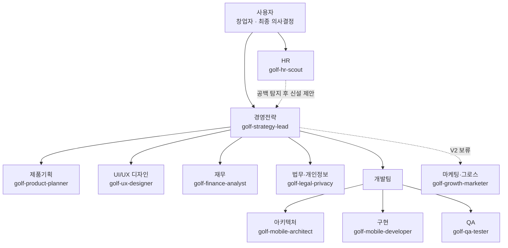

# 골프 템포 앱 — AI 에이전트 조직도

회사 조직 모델을 빌려, 이 프로젝트를 지원할 Claude Code 커스텀 서브에이전트 역할을 부서 단위로 정리한다.
실선은 보고 체계, 점선은 HR 에이전트의 제안 흐름이다.

## 조직도

범례: **초안 있음** = 제품/UX/아키텍처 (오늘 만든 프롬프트를 정식 등록만 하면 됨) · **신규** = 새로 만들어야 함 · **보류** = V2 단계

## 신규로 만들어야 하는 에이전트

| 에이전트 | 부서 | 역할 | 자동 호출 트리거 (description 초안) | 상태 |
|---|---|---|---|---|
| `golf-strategy-lead` | 경영전략 | 로드맵·우선순위 조율, 부서 간 산출물 충돌 시 트레이드오프 판단 | "우선순위 다시 짜줘", "이번 주 뭐부터 할지 판단해줘" | 신규 · MVP |
| `golf-hr-scout` | HR | 작업 성격을 보고 부족한 에이전트를 발굴해 신설 제안. **사용자 승인 후에만** `.claude/agents/`에 실제 등록 (자동 등록 금지) | "이 작업엔 어떤 에이전트가 필요할까", 새 기능 착수 시 | 신규 · MVP |
| `golf-product-planner` | 제품기획 | 기능 정의·우선순위·유저플로우 (오늘 작성한 프롬프트 그대로 등록) | 새 기능 제안, 기능 범위 판단 필요 시 | 초안 있음 |
| `golf-ux-designer` | UI/UX 디자인 | 화면 설계·인터랙션·접근성 (오늘 작성한 프롬프트 그대로 등록) | 새 화면 설계, 인터랙션 디테일 결정 시 | 초안 있음 |
| `golf-finance-analyst` | 재무 | 개발·운영 비용 추정(EAS Build, 스토어 수수료), 무료/유료 모델 손익 시나리오. xlsx 스킬로 표 작성 | 수익화 논의, 비용 산정 필요 시 | 신규 · MVP 후반 |
| `golf-legal-privacy` | 법무·개인정보 | 카메라롤/영상 접근 권한 문구, 개인정보처리방침 초안, 앱스토어/플레이스토어 심사 정책 체크리스트 | 스토어 제출 준비, 권한 요청 문구 작성 시 | 신규 · 제출 전 필수 |
| `golf-mobile-architect` | 개발·아키텍처 | 기술 스택·데이터 모델·리스크 설계 (오늘 작성한 프롬프트 그대로 등록) | 새 기술 결정, 구조 변경 검토 시 | 초안 있음 |
| `golf-mobile-developer` | 개발·구현 | 실제 React Native/Expo 코드 작성·수정, 아키텍처 설계를 코드로 구현 | 코딩 착수 즉시 | 신규 · MVP |
| `golf-qa-tester` | QA | 테스트 시나리오·엣지케이스 설계, run 스킬로 실제 앱 실행 후 회귀 확인 | 기능 완성 직후, 릴리즈 전 | 신규 · 코딩 착수 후 |
| `golf-growth-marketer` | 마케팅·그로스 | ASO, 출시 전략, 사용자 획득 채널 설계 | 출시 임박 시점 | 신규 · V2 보류 |

## 지금 바로 활용 가능한 기존 자원

새로 만들지 않아도 되는, Claude Code에 이미 있는 에이전트·스킬. 위 부서들이 작업 중 호출해 쓰면 된다.

| 자원 | 종류 | 활용 예 |
|---|---|---|
| `general-purpose` | 내장 에이전트 | 오늘 제품/UX/기술 기획에 쓴 것처럼, 병렬 리서치·브레인스토밍이 필요할 때 어느 부서든 호출 |
| `Explore` | 내장 에이전트 | 코드베이스가 커진 뒤 개발팀이 특정 파일·심볼 위치를 빠르게 찾을 때 |
| `Plan` | 내장 에이전트 | 아키텍트의 큰 그림을 실제 구현 단계로 세분화할 때 개발팀이 활용 |
| `claude-code-guide` | 내장 에이전트 | Claude Code/SDK 자체에 대한 질문 자문역 — HR 에이전트가 새 에이전트 스펙을 확인할 때 |
| `security-review` | 스킬 | 법무·개인정보 에이전트가 코드 차원의 보안 취약점을 스캔할 때 |
| `xlsx` / `dataviz` | 스킬 | 재무 에이전트가 손익 시나리오 표와 차트를 만들 때 |
| `docx` / `pptx` | 스킬 | 경영전략 에이전트가 의사결정 보고서나 공유용 덱을 만들 때 |
| `code-review` / `simplify` | 스킬 | 개발팀이 구현 에이전트의 코드 변경을 검토·정리할 때 |
| `run` | 스킬 | QA·개발 에이전트가 실제 앱을 띄워 화면으로 동작을 검증할 때 |

## HR 에이전트 거버넌스 메모

**HR 에이전트는 새 서브에이전트 파일을 스스로 등록하지 않는다.** 표준 안전 정책상 `.claude/agents/` 같은 영속 설정 변경은 사용자 승인이 필요한 영역이다. HR의 역할은 어디까지나 "이런 역할이 비어 있다"고 근거와 함께 제안하는 것까지이고, 실제 파일 생성은 사용자가 승인한 뒤 진행한다.
